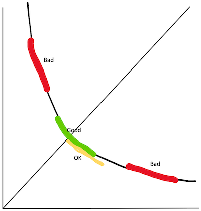
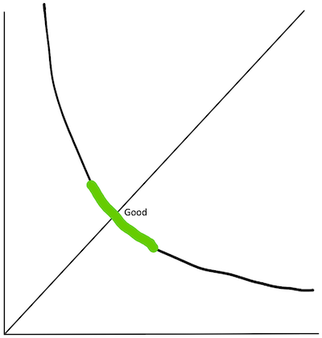
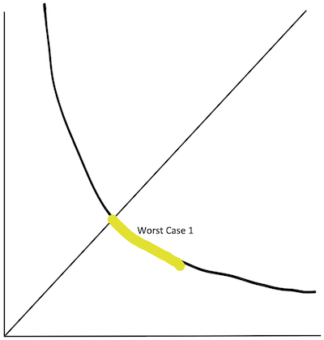
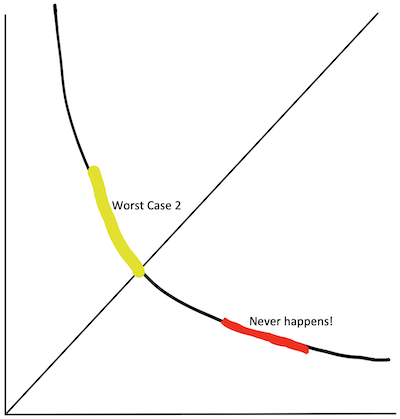
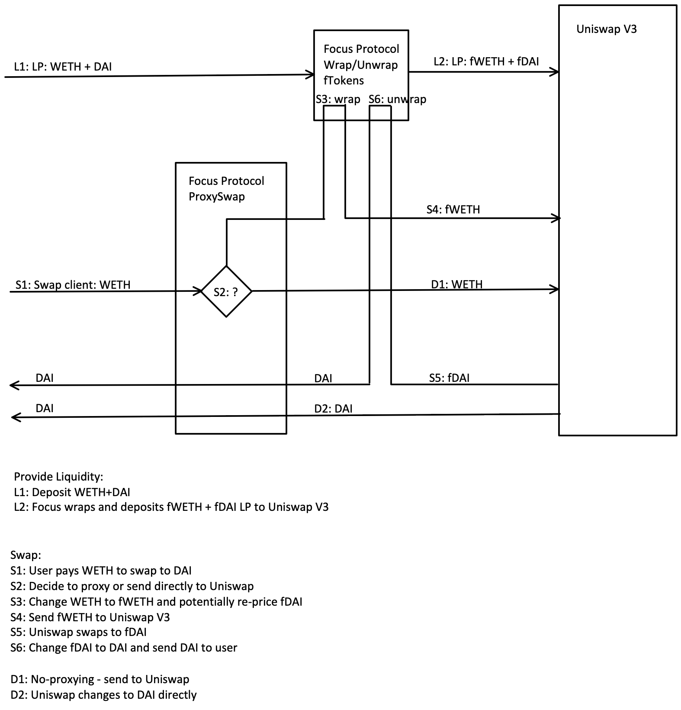

# Focus Protocol
Jordan Stojanovski
## Introduction

Uniswap V3 greatly improves capital efficiency iver its previous version by providing **concentrated liquidity** in a price range. However, this liqidity is active only while the spot price stays within the range of the provided liquidity. As soon as the price moves outside this range, two problems occur:
- The liquidity is no longer active, and it does not generate revenue for the provider.
- The liquidity provider is left holding the less desirable asset.

As liquidity providers deposit assets, they receive Non-Fungible Tokens (NFT) as an "ownership title", which can then be transferred to other owners or deposited as collateral into other Decentralized Finance (DeFi) protocols in order to produce additional revenue.

These LP NFTs are difficult to manage, as assets have to be liqudated and re-deposited into another position in order to chase the ongoing spot price. There are active DeFi protocols for managing LP positions en-masse, where the user jointly participates into a larger position and effectively owns a share of the managed position.

Our solution, the **Focus Protocol** provides passive Uniswap V3 liquidity, which always stays in the active range, amost always producing revenue for the owner. This greatly improves the Uniswap V3 concentrated liquidity.

We will show that the liquidity in the Focus Protocol provides a guaranteed improvement of efficiency and remedy against impermanent loss and holding an undesirable asset.
## What if ...

Uniswap V3 concentrated liquidity can fall out of range:

While the green LP performs well, the yellow one is only good if the price goes in one direction, but not the other. The red colored cases of LP are bad: they do not produce revenue and only the undesirable token is held.

What if we can shift the LP on-the-fly so that it is always in Focus. Enter the **Focus Protocol**. One cannot simply force price changes of assets already held. Instead, the Focus Protocol wraps both assets (tokens) in the LP into fTokens, special tokens that the Focus Protocol creates. fTokens are priced separately from the original tokens. Once one of the assets in the pair is completely sold off, the Focus Protocol takes the opportunity to re-price the corresponding fToken.

Focus Protocol acts as a proxy exchange which forwards the swap requests to Uniswap V3. However, while the original tokens are traded on the Focus proxy swap, Uniswap V3 sees only the fTokens, which are price adjusted so the resulting LP never goes "bad". The Focus proxy swap takes care of the price mapping and wrapping, so the user has total illusion that he trades only the original tokens:

## How Focus Protocol works

The Focus Protocol proxies all swap requests to Uniswap V3. While the original token liquidity may fall out of range, the proxied fToken liquidity never does:
- If the liquidity is in the active range, the exchanged tokens are simply wrapped.
- If the liquidity has become one-sided, the price of the fToken which holds no liquidity is harmlessly re-priced, so that the fToken pair liquidity touches the active range again. This keeps the fToken liquidity always in range.
- Only if it cannot make an improvement, it sends the swap request directly to Uniswap V3.

## Why Focus Protocol works

In Uniswap V3, as the LP goes further off-range, the chance to swap back to the desirable asset diminishes. In the Focus Protocol, the price of the desirable fToken constantly adjusts to stay at the edge of the active range. As soon as the price (market) turns around, the fToken LP starts working by creating revenue and re-acquiring the desirable asset.
## Advanced Strategies

For the UniCode Hackathon I only implemented expansion of the range when one of the assets in the LP is no longer held. 

In order to implement contraction of the range the protocol would have to "withold" part of the holdings of the asset already held, thus pausing the swap process.

The decision when to expand and when to contract (and effectively shift) the LP range, can be expanded into advanced strategies based on calculations, heuristics or machine learning. However, this is out of the scope of the UniCode hackathon, as it requires lengthy research and experimentation.

## Further work (after the Hackathon)

- The Focus Protocol needs path routing similar to Uniswap's. 
- After that, a front end DApp should be put together.
- Some advanced strategies can be researched and written.
## Demo

Since there is no front end yet, I am calling the smart contracts in the protocol from Remix. The Ropsten Etherscan links for the demo transactions are:

1.
2.
3.