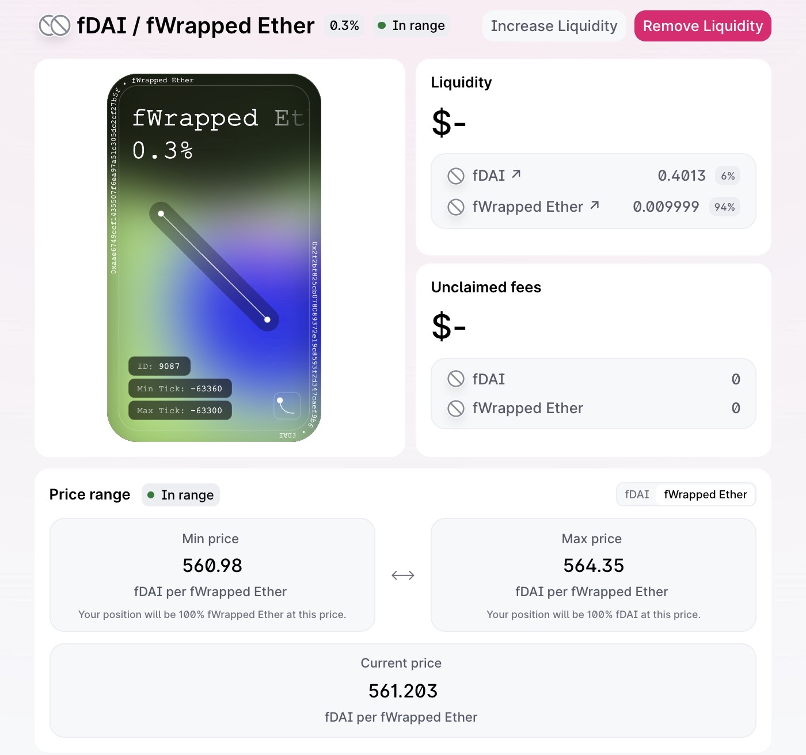

# Demo

The contracts for the Focus Protocol are deployed on **Ropsten**. Below is the entire calling sequence which shows the deployment addresses and the operation of the FocusProtocol.

## Tokens

DAI: 0xad6d458402f60fd3bd25163575031acdce07538d
WETH: 0xc778417e063141139fce010982780140aa0cd5ab

## ProxySwap

ProxySawp(DAI, WETH): 0xFD4396F1EcAA8655f19Eaa707f042DBD9cd50b08

fDAI: 0x2F2Bf825CB078089372e19C8593f2d347cAeF9B6
fWETH: 0xaAe6749CcF1435507f6EA97a51C305Dc2CF27b5f

## Constants

MAX_INT = 0xffffffffffffffffffffffffffffffffffffffffffffffffffffffffffffffff
1 * 10^18  = 1000000000000000000
0.1 * 10^18 = 100000000000000000
0.01 * 10^18 = 10000000000000000

## Owners

Account 1: 0xcfa2a823c7e89Fbb9fF0129345437260B9fb2BEe

## Authorize to wrap

Account 1: Approve fDAI to spend MAX_INT DAI: 0x6f7f81586525c7ce37f95974df0dbf30633f3de6b677652e2139d929da8b989d
Account 1: Approve fWETH to spend MAX_INT WETH: 0x73aa97216093f58ca024164fab683c10e527dfe95afb49ee6cbb824e0038cbb7

## Wrap
5.58 = 5580000000000000000
Wrap 5.58 DAI into fDAI: 0x1a3ea9a506b94a523ea4dff8b63cf94854044102c51d8849e824bfb9ecf7fd28
Wrap 0.01 WETH into fWETH: 0xe2e818231c8bf31be93dac0d5e60cc871f9de7e717b603f8e7b3a191b3c25bfb

## Add Uniswap V3 LP

0x119ca8290a5933da38aa80d62b64483f4aeedb8389be985932026c066155d4be:
    fDAI/fWETH Uniswap V3 LP NFT: 0xc36442b4a4522e871399cd717abdd847ab11fe88 Token ID: 9087

## Add Uniswap V3 LP to Focus Protocol

ProxySwap.setMyLP(9087): 0x3cd1af871f54a517a20df8cd9a13c9027728ff7bc2f87363a51ad43dd35c4835
A.myLPRangeLower96: 140387138431067093704323622
B.myLPRangeLower96: 141231950924905045784266773

## Authorize ProxySwap to move

Account 1: Approve ProxySwap to spend MAX_INT DAI: 0xf7d10ffb4668903d1d2911ea8cf08baa707c7bdbaf023c86e98273770268229f
Account 1: Approve ProxySwap to spend MAX_INT WETH: 0xb93c1a39f43ba55ba631512b5f0f192757e44c3a47bf0afa0bd14a845d113a5a

## Perform swaps

Swap DAI -> 0.02 WETH: 0x17f19c9f3dcca2120064c51ca9a7237cf301d2320cf244e2e43213d6fdd3680d-failed
0.02 = 20000000000000000 - fail (I have a tick math rounding issue - to fix use next tick up/down dependent on direction)
Swap DAI -> 0.0001 WETH: 0x124c6955259c68756ae4c7b9e49e1ec86bd673804e74c3b55eb3cfc3fbfdfac8
0.02 = 100000000000000

Swap WETH -> 0.1 DAI: 0x2d04c1f8ac192d2a9e8c336d0e327efe45ae0abdfd74305eae43e1abda686a50

