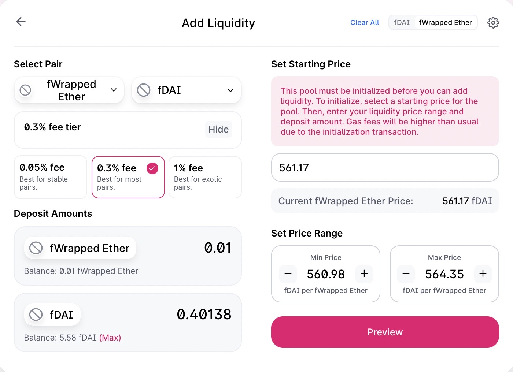

# Addresses on Ropsten

## Tokens

DAI: 0xad6d458402f60fd3bd25163575031acdce07538d
WETH: 0xc778417e063141139fce010982780140aa0cd5ab

## ProxySwap

ProxySawp(DAI, WETH): 0xDfb0334c40fCCcF4FEF717904740c1216620dBe1

fDAI: 0x09181807c94dd0B66b4c9fE90b9Fc3139245C492
fWETH: 0x09Fbc7A9F6769ef4b89C5E9f5D25F8C0821e06F8

## Constants

MAX_INT = 0xffffffffffffffffffffffffffffffffffffffffffffffffffffffffffffffff
1 * 10^18  = 1000000000000000000
0.1 * 10^18 = 100000000000000000
0.01 * 10^18 = 10000000000000000

## Owners

Account 1: 0xcfa2a823c7e89Fbb9fF0129345437260B9fb2BEe

## Authorize to wrap

Account 1: Approve fDAI to spend DAI: 0xeed2b9fa9bb075d08162084fdfaa3e4e80177e2ea5d953a0dfe1189f3f3e6dfb
Account 1: Approve fWETH to spend WETH: 0xfd76e34cb72d6685e7982e27fef81bf92ab3edac067f1594f47aafc0d46efe6b

## Wrap
5.58 = 5580000000000000000
Wrap 5.58 DAI into fDAI: 0x865101f8725e638d2ddd8caab5f9121b0f1c93f5c9e47e515b71607e362cac58
Wrap 0.01 WETH into fWETH: 0xcae9271c7edbd2a3b04d14b82144dd5f0d44c768a0db85c959b9ae65033b9b79

## Add Uniswap V3 LP

0xf45e3b82576e4f41d33f921abd29f5d2533429d443a91a0f77b1c1b132fbdf60:
    fDAI/fWETH Uniswap V3 LP NFT: 0xc36442b4a4522e871399cd717abdd847ab11fe88 Token ID: 9070

## Add Uniswap V3 LP to Focus Protocol

ProxySwap.setMyLP(9070): 0xe582416e8fdb83bc46d7b9001319107d9fe54c954a3b748dc987feb91a5b763e
A.myLPRangeLower96: 141231950924905045784266773
B.myLPRangeLower96: 142081847275837892243482337

## Authorize ProxySwap to move

Account 1: Approve ProxySwap to spend DAI: 0xe6352a43408f591d5a0db931f12b04d462aabdd8d58596de8640b22bb0e61451
Account 1: Approve ProxySwap to spend WETH: 0x242dae6c9fa1ec77ef3a9f6ef47de5dcb6fc3c8104bf8665d983354ad52acdbc

## Perform swaps

Swap DAI -> 0.02 WETH: 0xdaebacdd691157aec7e49b37ea2f3079b40c87baff40aa601a9b17a75dc45a73
0.02 = 20000000000000000
